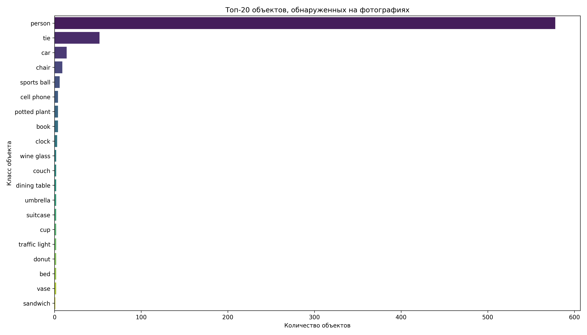
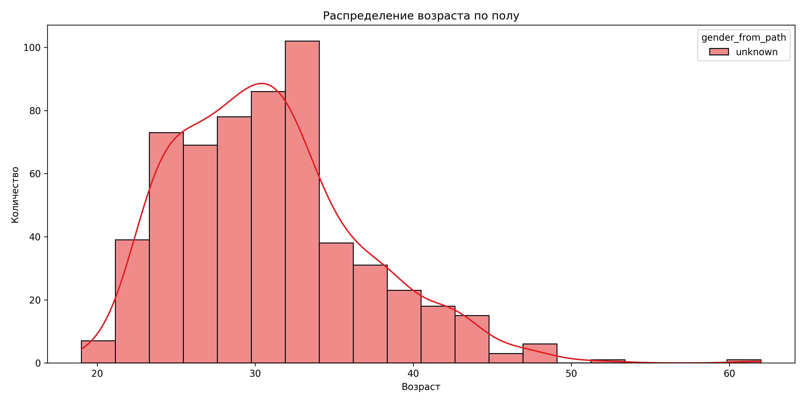
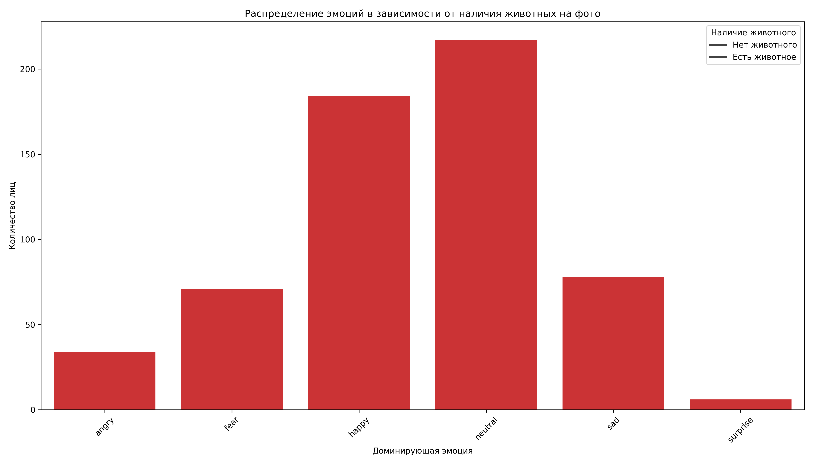

# Анализ фотоархива с помощью нейросетевых методов

## Описание проекта

Этот проект представляет собой инструмент для анализа фотоархива с использованием современных методов компьютерного зрения и машинного обучения. Программа извлекает структурированные данные из фотографий, применяя нейросетевые инструменты (YOLO и DeepFace), и строит визуализации для анализа различных аспектов фотоархива.

В качестве набора данных используется "Human Images Dataset Men and Women" с платформы Kaggle, содержащий фотографии мужчин и женщин разных возрастов. Однако программа может анализировать любой набор фотографий, включая личный фотоархив.

## Извлекаемые признаки

Из фотографий извлекаются следующие признаки:

1. **Объекты на фотографиях** - с помощью YOLO определяются все видимые объекты на фотографиях (люди, предметы, животные и т.д.)
2. **Лица и их характеристики** - с помощью DeepFace определяются:
   - Эмоции на лицах (счастье, грусть, удивление и т.д.)
   - Примерный возраст людей
   - Пол людей
3. **Тип местоположения** - на основе обнаруженных объектов программа классифицирует фотографии по типу местоположения:
   - Помещение (по наличию мебели, бытовых предметов)
   - Улица (по наличию транспорта, деревьев, природных объектов)
4. **Наличие животных** - отдельно отмечается наличие кошек и собак на фотографиях
5. **Количество лиц** - подсчитывается количество лиц на каждой фотографии

## Генерируемые графики и визуализации

Программа создает следующие визуализации:

### 1. Анализ объектов
- **object_frequency.png** - частотный график присутствия разных объектов на фотографиях (топ-20 наиболее частых объектов)

### 2. Анализ местоположения
- **location_bar.png** - распределение фотографий по типу местоположения (помещение/улица/неопределено) в виде столбчатой диаграммы
- **location_pie.png** - распределение фотографий по типу местоположения в виде круговой диаграммы

### 3. Анализ эмоций и пола
- **emotion_by_gender.png** - распределение эмоций в зависимости от пола (показывает, какие эмоции чаще проявляют мужчины и женщины)
- **gender_comparison.png** - сравнение пола, определенного из названия файла, с полом, распознанным с помощью DeepFace

### 4. Возрастной анализ
- **age_histogram.png** - распределение возраста в зависимости от пола (гистограмма)
- **age_boxplot.png** - распределение возраста в зависимости от пола (диаграмма размаха)

### 5. Анализ влияния окружения на эмоции
- **emotion_by_location.png** - распределение эмоций в зависимости от типа местоположения (помещение/улица)

### 6. Анализ влияния животных на эмоции
- **emotion_by_cats.png** - распределение эмоций в зависимости от наличия кошек на фото
- **emotion_by_dogs.png** - распределение эмоций в зависимости от наличия собак на фото
- **emotion_by_animals.png** - распределение эмоций в зависимости от наличия любых животных на фото

### 7. Анализ социального контекста
- **face_count_distribution.png** - распределение количества лиц на фотографиях
- **face_count_by_gender.png** - распределение количества лиц на фотографиях в зависимости от пола

## Методология анализа

1. **Обнаружение объектов с YOLO**:
   - Используется предобученная модель YOLOv8n
   - Обнаруживаются объекты из более чем 80 классов
   - Для каждого объекта сохраняется класс и уверенность модели

2. **Анализ лиц с DeepFace**:
   - Обнаружение лиц на фотографиях
   - Определение доминирующей эмоции (счастье, грусть, злость, удивление, страх, отвращение, нейтральность)
   - Оценка возраста
   - Определение пола

3. **Классификация местоположения**:
   - На основе обнаруженных объектов (мебель указывает на помещение, транспорт и природные объекты - на улицу)

4. **Связь признаков**:
   - Все извлеченные признаки связываются между собой для проведения комплексного анализа
   - Создаются графики зависимостей между различными признаками (эмоции и пол, эмоции и животные и т.д.)

## Установка и запуск

### Установка зависимостей

```bash
# Клонирование репозитория
git clone https://github.com/username/photo-analysis.git
cd photo-analysis

# Создание виртуального окружения
python -m venv venv
source venv/bin/activate  # Linux/Mac
# или
venv\Scripts\activate     # Windows

# Установка зависимостей
pip install -r requirements.txt
```

### Загрузка датасета

```bash
# Если у вас есть API Kaggle
python download_dataset.py --username YOUR_KAGGLE_USERNAME --key YOUR_KAGGLE_API_KEY

# Или с использованием kagglehub
python download_kagglehub.py
```

### Запуск анализа

```bash
# Базовый запуск
python photo_analysis.py

# Запуск с указанием параметров
python photo_analysis.py --image_dir datasets/human_images --sample_size 500 --output_dir results

# Запуск с исключением проблемных файлов
python photo_analysis.py --exclude_file exclude_files.txt
```

## Параметры командной строки

- `--image_dir` - путь к директории с фотографиями (по умолчанию: datasets/human_images)
- `--sample_size` - максимальное количество фотографий для анализа (по умолчанию: 500)
- `--output_dir` - директория для сохранения результатов (по умолчанию: results)
- `--exclude` - список файлов, которые следует исключить из анализа
- `--exclude_file` - файл со списком файлов для исключения

## Структура проекта

```
.
├── photo_analysis.py           # Основной скрипт анализа
├── download_dataset.py         # Скрипт для загрузки датасета через Kaggle API
├── download_kagglehub.py       # Скрипт для загрузки датасета через kagglehub
├── setup_env.sh                # Скрипт для настройки окружения
├── requirements.txt            # Зависимости проекта
├── exclude_files.txt           # Список исключаемых файлов
├── README.md                   # Этот файл
├── datasets/                   # Директория с датасетами
│   └── human_images/           # Датасет с фотографиями
└── results/                    # Директория с результатами анализа
    ├── object_frequency.png
    ├── location_bar.png
    ├── location_pie.png
    ├── emotion_by_gender.png
    ├── gender_comparison.png
    ├── age_histogram.png
    ├── age_boxplot.png
    ├── emotion_by_location.png
    ├── emotion_by_cats.png
    ├── emotion_by_dogs.png
    ├── emotion_by_animals.png
    ├── face_count_distribution.png
    ├── face_count_by_gender.png
    ├── objects_data.csv
    ├── faces_data.csv
    └── image_data.csv
```

## Примеры результатов

### Частотный график объектов


Этот график показывает, какие объекты чаще всего встречаются на фотографиях. Для датасета с людьми ожидаемо, что класс "person" будет наиболее частым.

### Распределение эмоций по полу


Этот график показывает, какие эмоции чаще проявляют мужчины и женщины на фотографиях. Можно увидеть, различаются ли эмоциональные выражения у разных полов.

### Возрастное распределение


Гистограмма показывает распределение возраста людей на фотографиях, разделенное по полу. Позволяет увидеть возрастные характеристики датасета.

### Влияние животных на эмоции


Этот график показывает, как наличие животных на фотографиях связано с эмоциями людей. Можно проверить гипотезу, что люди чаще улыбаются на фотографиях с животными.

## Заключение

Проект демонстрирует возможности современных методов компьютерного зрения для анализа фотоархивов. С помощью YOLO и DeepFace извлекаются различные структурированные данные из фотографий, которые затем визуализируются для выявления интересных закономерностей и связей.

Эти методы могут быть применены к любому набору фотографий, позволяя проводить разнообразные исследования в области компьютерного зрения, анализа данных и социальных наук. 